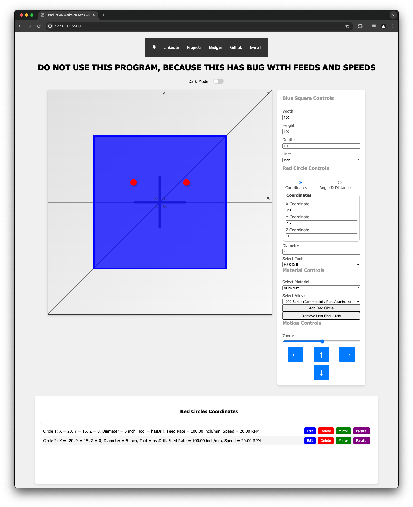

The version one machinist calculator is a sophisticated tool with over 8000 lines of code, using CSS, HTML, and JavaScript. Its CSS ensures a user-friendly and visually appealing interface, while HTML structures the content. JavaScript powers the dynamic operations, enabling complex calculations and real-time data processing. This makes the machinist calculator both powerful and intuitive, essential for professionals in the machining industry.

HOW TO RUN 
------------------------------------
* To get started, navigate to the Machinist-calculator repository on GitHub and download the files. Then, open the folder in Visual Studio Code and launch the live server extension. This action  will automatically open the project in your default web browser.

Click here to view live:
[Visit website](https://08milam.github.io/machinist-calculator/)

TECHNOLOGY STACK USED
------------------------------------
* HTML
* CSS
* JavaScript

